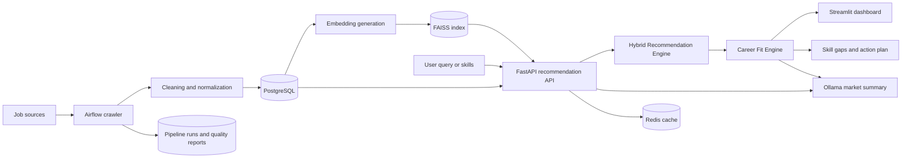

# Pivot — AI Job Market Intelligence Platform

Pivot is an AI-powered career intelligence platform that turns a user's skills, goals, and natural-language job search into an explainable career fit report.

Instead of returning a list of job postings only, Pivot answers four practical questions:

1. Which roles are the strongest fit?
2. Why is each role recommended?
3. Which skills are missing or underrepresented?
4. What should the user do next?

> AI career intelligence platform · Python · FastAPI · Streamlit · PostgreSQL · FAISS · Ollama

## Product flow

```text
User skills / career goal
          ↓
Semantic job retrieval with FAISS
          ↓
Career Fit Engine
          ├── Match score and reasons
          ├── Career direction ranking
          ├── Skill-gap analysis
          └── Action plan
          ↓
Pivot intelligence dashboard
```

## Core capabilities

### Explainable job matching

- Semantic search over job postings using embeddings and FAISS
- Match score for every recommended position
- Human-readable reasons explaining the recommendation
- Skill gaps attached to each job

## How recommendation works

Recommendation is a retrieval, reranking, and explanation flow:

```text
Natural-language query
        ↓
Query embedding with Sentence Transformers
        ↓
FAISS nearest-neighbor retrieval
        ↓
PostgreSQL job hydration
        ↓
Hybrid reranking
        ↓
Semantic + skill + role + history signals
        ↓
Explainable Career Fit Report
```

### Stage 1 — semantic retrieval

The user's query is converted into an embedding vector and normalized before it is searched against the FAISS index. The nearest job vectors are selected as the initial candidate set. This lets queries such as `"want to move into data analytics with Python"` find relevant roles even when the exact phrase does not appear in a job title.

### Stage 2 — hybrid reranking

FAISS provides a broad candidate set; it is not the final recommendation order. The recommendation engine reranks candidates using a weighted combination of:

- Semantic similarity from the embedding search
- Skill overlap between the user's query and the job
- Role/title alignment with the user's intent
- Affinity with the user's previous searches when authenticated
- Freshness of the job posting
- Positive and negative behavioral signals from views, saves, applications, and dismissals

This makes the output a recommendation instead of a plain nearest-neighbor search result. Duplicate job IDs are removed before the final ranking, and each job receives a recommendation label such as `Strong recommendation`, `Good recommendation`, or `Explore`.

### Stage 3 — recommendation explanation

The reranked job IDs are loaded from PostgreSQL, then enriched with:

- `score`: the original FAISS similarity score
- `recommendation_score`: the final hybrid ranking score
- `recommendation_reasons`: the strongest reasons for the recommendation
- `match_score`: the career-fit percentage used by the explanation layer
- `match_reasons`: the strongest skill and role signals
- `skill_gaps`: skills present in the target role but not represented in the query/profile signal

The result set is then grouped into possible career directions. Each direction includes fit score, market demand within the result set, matching skills, priority gaps, and a recommended action plan.

The current recommendation implementation is retrieval-based with a hybrid reranking layer. It does not invent jobs or claim that a user is qualified; it ranks jobs based on the available embedding index, job metadata, and — when available — behavioral feedback. The optional Ollama layer generates a market summary after retrieval and does not replace the ranking engine.

### Career Fit Report

- An optional learned ranker can replace the default `hybrid-v1` weights after enough labeled interaction data is collected.
- Top career direction inferred from the result set
- Alternative role directions with fit score and market demand
- Strengths detected from the user's query
- Priority skills to develop
- Short, actionable next-step plan

### Market intelligence

- Hiring distribution by industry
- Experience-level distribution
- Most requested skills
- Career progression and skill-gap analysis
- Optional AI-generated market summary through Ollama
- Offline ranking metrics: Precision@K, Recall@K, MRR, and NDCG@K

### Data reliability

- Incremental job upsert with active/expired job tracking
- Salary, source URL, first-seen, and last-seen metadata
- JSON data-quality report for every cleaning run
- Airflow task lineage persisted in `pipeline_runs`
- Recommendation impressions with request ID, rank position, features, and model version

### Platform features

- Google OAuth login
- Personalized search suggestions
- Search history
- Behavioral feedback (`view`, `save`, `apply`, `dismiss`)
- Job detail lookup
- Scheduled data pipeline with Airflow
- Docker Compose deployment

## System architecture



## Technology stack

| Layer | Technology |
| --- | --- |
| Frontend | Streamlit, Matplotlib |
| API | FastAPI, Uvicorn, ORJSON |
| Storage | PostgreSQL, psycopg2 |
| Search | Sentence Transformers, FAISS |
| AI analysis | Ollama, prompt service |
| Caching | Redis |
| Data pipeline | Apache Airflow, Celery |
| Deployment | Docker Compose |

## Repository structure

```text
.
├── dags/
│   └── job_pipeline.py              # Airflow orchestration
├── frontend/
│   └── app.py                       # Pivot Streamlit application
├── initdb/
│   ├── 01-init-schema.sql           # PostgreSQL schema
│   ├── 02-user-job-events.sql       # Behavioral-event migration
│   └── 03-platform-hardening.sql    # Impressions and pipeline metadata
├── src/
│   ├── api/
│   │   ├── deps.py                  # Dependency wiring
│   │   └── routes/                  # FastAPI route modules
│   ├── core/                        # Database, cache, security
│   ├── crawl/                       # Crawling, quality, and lineage
│   ├── evaluation/                  # Offline ranking metrics
│   ├── ml/                          # Embedding, FAISS, Ollama, ranker
│   │   └── learning_ranker.py       # Optional learned ranking model
│   ├── repositories/                # Database access and event storage
│   ├── services/
│   │   ├── analytics_service.py    # Market analytics
│   │   ├── career_fit_service.py   # Explainable career-fit engine
│   │   ├── job_event_service.py    # Behavioral events and impressions
│   │   ├── job_service.py          # Job operations
│   │   └── recommend_service.py    # Recommendation orchestration
│   └── main.py                      # FastAPI application entry point
├── docker-compose.yml
├── Dockerfile
├── requirements.txt
└── README.md
```

## Quick start with Docker

### 1. Configure environment variables

Create a `.env` file in the project root:

```env
JOB_DB_USER=jobuser
JOB_DB_PASS=jobpass123
JOB_DB_NAME=jobdb
JOB_DB_PORT=5433
JOB_DB_INTERNAL_PORT=5432

GOOGLE_CLIENT_ID=your-google-client-id
GOOGLE_CLIENT_SECRET=your-google-client-secret
SECRET_KEY=replace-with-a-long-random-secret
SESSION_SECRET=replace-with-another-long-random-secret
CORS_ORIGINS=http://localhost:8501
EMBEDDING_MODEL_NAME=sentence-transformers/all-MiniLM-L6-v2
EMBEDDING_MODEL_VERSION=all-minilm-l6-v2
RECOMMENDATION_MODEL_VERSION=hybrid-v1

OLLAMA_HOST=http://ollama:11434
```

For Google OAuth, configure the callback URL registered in Google Cloud to match the environment where the API is running.

### 2. Start the platform

```bash
docker compose up -d --build
```

### 3. Open the applications

| Application | URL |
| --- | --- |
| Pivot dashboard | http://localhost:8501 |
| FastAPI Swagger UI | http://localhost:8000/docs |
| API health check | http://localhost:8000/health |
| Airflow | http://localhost:8080 |

The default Airflow credentials in the compose file are `airflow` / `airflow`. Change them before using the system outside a local environment.

If the PostgreSQL volume already existed before the latest schema changes, apply the idempotent migrations manually:

```bash
docker compose exec job-postgres \
  psql -U jobuser -d jobdb \
  -f /docker-entrypoint-initdb.d/02-user-job-events.sql

docker compose exec job-postgres \
  psql -U jobuser -d jobdb \
  -f /docker-entrypoint-initdb.d/03-platform-hardening.sql
```

## Data pipeline

The Airflow DAG is defined in `dags/job_pipeline.py`:

```text
crawl_jobs
    ↓
clean_jobs
    ↓
load_to_database
    ↓
train_model
```

The pipeline collects job postings, cleans the raw data, loads normalized records into PostgreSQL, and rebuilds the embedding/FAISS index used by the recommendation API.

Each cleaning run writes a quality report under `data/logs/quality_*.json`. Each Airflow task also records its status and basic metrics in `pipeline_runs`.

## API overview

| Method | Endpoint | Purpose |
| --- | --- | --- |
| `POST` | `/recommend/` | Recommend jobs from a query |
| `POST` | `/recommend/analytics` | Return recommendations, analytics, and Career Fit Report |
| `GET` | `/recommend/personalized` | Return personalized suggestions |
| `GET` | `/recommend/summary` | Retrieve the cached AI market summary |
| `GET` | `/jobs/{job_id}` | Retrieve job details |
| `GET` | `/jobs/search` | Search jobs by keyword |
| `GET` | `/jobs/filter` | Filter jobs by city, level, or industry |
| `GET` | `/history` | Retrieve authenticated user's search history |
| `POST` | `/events/job` | Record a user's job interaction |

### Behavioral recommendation signals

Authenticated users can send job interactions to `/events/job`:

```json
{
  "job_id": 42,
  "event_type": "save",
  "metadata": {}
}
```

The ranking layer uses these signals with different strengths:

| Event | Recommendation meaning | Relative weight |
| --- | --- | ---: |
| `view` | Initial interest | 0.5 |
| `save` | Strong interest | 2.0 |
| `apply` | Highest intent | 3.0 |
| `dismiss` | Negative preference | Penalty up to 25 points |

Events are stored in the append-only `user_job_events` table. The next recommendation request combines the user's recent event profile with semantic similarity, skill overlap, and role alignment to rerank candidates.

### Recommendation example

Request:

```http
POST /recommend/analytics
Content-Type: application/json

{
  "text": "Python SQL Data Analyst",
  "top_k": 100
}
```

The response contains both ranked jobs and the explanation layer:

```json
{
  "query": "Python SQL Data Analyst",
  "count": 2,
  "results": [
    {
      "job_id": 42,
      "job_title": "Data Analyst",
      "score": 0.87,
      "recommendation_score": 91,
      "recommendation_label": "Strong recommendation",
      "recommendation_reasons": [
        "Khớp kỹ năng: Python, SQL",
        "Tên vai trò gần với mục tiêu tìm kiếm"
      ],
      "match_score": 91,
      "match_reasons": [
        "Khớp kỹ năng: Python, SQL",
        "Tên vai trò gần với mục tiêu tìm kiếm"
      ],
      "skill_gaps": ["Tableau"]
    }
  ],
  "career_fit": {
    "top_direction": {
      "role": "Data Analyst",
      "fit_score": 86,
      "market_demand": 12,
      "matched_skills": ["python", "sql"],
      "skill_gaps": ["tableau"]
    },
    "action_plan": []
  }
}
```

`top_k` controls how many candidates are retrieved for ranking and analysis. The dashboard may display a smaller number of cards while retaining the larger candidate set for more reliable market insights.

The main analytics response now includes a `career_fit` object with the following structure:

```json
{
  "career_fit": {
    "headline": "Data Analyst is the strongest direction...",
    "top_direction": {},
    "directions": [],
    "profile_strengths": [],
    "priority_gaps": [],
    "action_plan": []
  }
}
```

## Local development

Install dependencies:

```bash
python -m venv .venv
# Windows
.venv\\Scripts\\activate
# macOS / Linux
source .venv/bin/activate

pip install -r requirements.txt
```

Run the API:

```bash
uvicorn src.main:app --reload --port 8000
```

Run the frontend in a second terminal:

```bash
streamlit run frontend/app.py
```

When running the frontend outside Docker, set the API URL to the local API:

```bash
# PowerShell
$env:API_URL = "http://localhost:8000"
```

Run the offline ranking metric example:

```bash
python -m src.evaluation.evaluate_sample
```

After enough authenticated feedback has been collected, train the optional learned ranker:

```bash
python -m src.train.train_ranker
```

The ranker is saved to `data/models/ranker.json`. If the file is absent, the API safely uses the deterministic `hybrid-v1` weights.

## Production considerations

Before production deployment, the following configuration should be hardened:

- Use a secret manager for JWT and session secrets in production.
- Keep CORS origins restricted to the deployed frontend.
- Use HTTPS for OAuth redirects and user sessions.
- Replace default database and Airflow credentials.
- Add automated tests and CI checks for the crawler, recommendation engine, ranker, and Career Fit Engine.
- Add monitoring for embedding freshness, API latency, and pipeline failures.

## Roadmap

- Resume and profile parsing
- Salary and location intelligence
- Time-series job demand trends
- Recommendation A/B testing from impression logs
- Model registry and automated ranker retraining
- Interview preparation based on detected skill gaps
- Multi-source job aggregation with deduplication

## Author

Vu Nguyen
Intelligent Job Recommendation System
